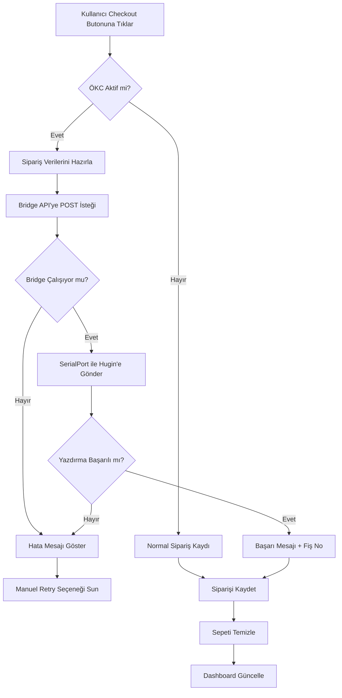
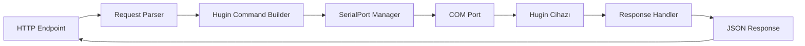

# 🖨️ Hugin Yazar Kasa (ÖKC) Entegrasyon Planı

## 📋 Proje Özeti

KahvePOS web uygulamasını Hugin 3100/3200 GİB uyumlu yazar kasa cihazlarına entegre etmek için **Bridge Application** mimarisi kullanılacak.

---

## 🎯 Gereksinimler

- **Yazar Kasa:** Hugin 3100/3200 (GİB uyumlu ÖKC)
- **Bağlantı Tipi:** USB/COM Port
- **Mimari:** Masaüstü Bridge Uygulaması + Web Entegrasyon
- **Platform:** Windows (COM port desteği için)

---

## 🏗️ Sistem Mimarisi

```
┌─────────────────┐         HTTP POST          ┌──────────────────┐
│   KahvePOS      │────────────────────────────>│  Bridge App      │
│ (Web Tarayıcı)  │     (localhost:3000)        │  (Node.js)       │
└─────────────────┘                             └──────────────────┘
                                                          │
                                                          │ SerialPort
                                                          │ (USB/COM)
                                                          ▼
                                                 ┌──────────────────┐
                                                 │  Hugin 3100/3200 │
                                                 │   Yazar Kasa     │
                                                 └──────────────────┘
```

### İletişim Akışı

1. **Kullanıcı** KahvePOS'ta siparişi tamamlar (checkout butonuna tıklar)
2. **KahvePOS** fiş verilerini JSON formatında Bridge'e gönderir
3. **Bridge App** Hugin protokol komutlarını oluşturur
4. **Hugin Cihazı** fişi yazdırır ve GİB'e bildirir
5. **Bridge App** sonucu KahvePOS'a döner
6. **KahvePOS** kullanıcıya sonuç mesajını gösterir

---

## 🔧 Teknik Detaylar

### 1. Bridge Uygulaması (Node.js)

**Gerekli Paketler:**
```json
{
  "dependencies": {
    "express": "^4.18.2",
    "serialport": "^11.0.0",
    "cors": "^2.8.5",
    "body-parser": "^1.20.2"
  }
}
```

**Temel Özellikler:**
- HTTP sunucu (Port: 3000)
- CORS desteği (KahvePOS'tan erişim için)
- SerialPort ile COM iletişimi
- Hugin protokol komutları
- Health check endpoint
- Hata yönetimi ve loglama

**API Endpoints:**

```javascript
POST /api/print-receipt
- Fiş yazdırma
- Body: { items, total, discount, note, payment }
- Response: { success, message, receiptNo }

GET /api/status
- Cihaz durumu kontrolü
- Response: { connected, port, ready }

GET /api/ports
- Mevcut COM portlarını listele
- Response: { ports: ["COM1", "COM3"] }

POST /api/test-print
- Test fişi yazdır
- Response: { success, message }
```

### 2. Hugin Protokol Komutları

Hugin yazar kasalar için ESC/POS benzeri komut seti:

```
Fiş Başlığı:
- ESC + "@" + "\r\n"
- Firma bilgisi
- Adres
- VKN/TCKN

Satır Ekle:
- Ürün adı (max 40 karakter)
- Miktar x Birim Fiyat = Toplam
- KDV oranı

İndirim:
- ISKONTO komutu
- Yüzde veya tutar bazlı

Ödeme:
- ODEME_NAKİT veya ODEME_KREDİ_KARTI
- Toplam tutar

Fiş Son:
- ESC + "E" + "\r\n"
- Kesim komutu
```

### 3. KahvePOS Değişiklikleri

#### A. Ayarlar Sayfası Güncellemeleri

[`index.html`](index.html) - Settings Modal'a eklenecek bölüm:

```html
<div class="settings-section">
    <h3>🖨️ Yazar Kasa (ÖKC) Ayarları</h3>
    <div class="form-group">
        <label style="display: flex; align-items: center; gap: 0.5rem;">
            <input type="checkbox" id="okc-enabled" onchange="toggleOKC()">
            <span>Yazar Kasa Kullan (Hugin)</span>
        </label>
    </div>
    
    <div id="okc-settings" style="display: none;">
        <div class="form-group">
            <label for="okc-port">COM Port</label>
            <select id="okc-port" onchange="saveOKCSettings()">
                <option value="auto">Otomatik Algıla</option>
                <option value="COM1">COM1</option>
                <option value="COM2">COM2</option>
                <option value="COM3">COM3</option>
                <option value="COM4">COM4</option>
                <option value="COM5">COM5</option>
            </select>
        </div>
        
        <div class="form-group">
            <label style="display: flex; align-items: center; gap: 0.5rem;">
                <input type="checkbox" id="okc-auto-print" checked onchange="saveOKCSettings()">
                <span>Sipariş tamamlandığında otomatik yazdır</span>
            </label>
        </div>
        
        <div class="okc-status">
            <p>
                <span>Bridge Durumu:</span>
                <span id="okc-bridge-status">❌ Bağlı Değil</span>
            </p>
            <p>
                <span>Cihaz Durumu:</span>
                <span id="okc-device-status">❌ Algılanamadı</span>
            </p>
        </div>
        
        <div class="okc-actions">
            <button class="btn-secondary" onclick="checkOKCStatus()">🔄 Durumu Kontrol Et</button>
            <button class="btn-primary" onclick="printTestReceipt()">🖨️ Test Fişi Yazdır</button>
        </div>
    </div>
</div>
```

#### B. JavaScript Modülü - [`js/okc.js`](js/okc.js)

Yeni bir modül oluşturulacak:

```javascript
/**
 * OKC.js
 * Yazar Kasa (ÖKC) Entegrasyon Modülü
 */

const OKC = {
    bridgeUrl: 'http://localhost:3000/api',
    enabled: false,
    autoPrint: true,
    port: 'auto',
    
    // Ayarları yükle
    loadSettings() {
        const settings = Storage.get('okc_settings');
        if (settings) {
            this.enabled = settings.enabled || false;
            this.autoPrint = settings.autoPrint !== false;
            this.port = settings.port || 'auto';
        }
    },
    
    // Ayarları kaydet
    saveSettings() {
        Storage.set('okc_settings', {
            enabled: this.enabled,
            autoPrint: this.autoPrint,
            port: this.port
        });
    },
    
    // Bridge durumunu kontrol et
    async checkStatus() {
        try {
            const response = await fetch(`${this.bridgeUrl}/status`);
            if (response.ok) {
                return await response.json();
            }
            return { connected: false };
        } catch (error) {
            return { connected: false, error: error.message };
        }
    },
    
    // Fiş yazdır
    async printReceipt(orderData) {
        if (!this.enabled) {
            return { success: true, skipped: true };
        }
        
        try {
            const response = await fetch(`${this.bridgeUrl}/print-receipt`, {
                method: 'POST',
                headers: { 'Content-Type': 'application/json' },
                body: JSON.stringify({
                    items: orderData.items,
                    subtotal: orderData.subtotal,
                    discount: orderData.discountAmount,
                    total: orderData.totalAmount,
                    note: orderData.customerNote,
                    payment: 'NAKIT'
                })
            });
            
            const result = await response.json();
            return result;
            
        } catch (error) {
            return { 
                success: false, 
                error: 'Bridge uygulamasına bağlanılamadı' 
            };
        }
    }
};
```

#### C. Checkout Fonksiyonu Güncellemesi

[`js/cart.js`](js/cart.js:265) - [`checkout()`](js/cart.js:265) fonksiyonuna ekleme:

```javascript
// Siparişi tamamla
async function checkout() {
    if (cart.length === 0) {
        showToast('Sepet boş!', 'error');
        return;
    }
    
    // Müşteri notunu al
    const noteInput = document.getElementById('cart-note-input');
    customerNote = noteInput ? noteInput.value.trim() : '';
    
    const totalAmount = calculateCartTotal();
    const totalCost = calculateCartCost();
    const profit = totalAmount - totalCost;
    
    const order = {
        id: generateUUID(),
        items: [...cart],
        subtotal: calculateSubtotal(),
        discountPercent: discountPercent,
        discountAmount: discountAmount,
        totalAmount: totalAmount,
        totalCost: totalCost,
        profit: profit,
        itemCount: getCartItemCount(),
        customerNote: customerNote,
        createdBy: getCurrentUser() ? getCurrentUser().username : 'Bilinmeyen',
        createdAt: new Date().toISOString()
    };
    
    // Satışı kaydet
    if (Storage.addSale(order)) {
        // 🆕 ÖKC entegrasyonu - Fiş yazdır
        if (OKC.enabled && OKC.autoPrint) {
            const printResult = await OKC.printReceipt(order);
            
            if (!printResult.success) {
                showToast('⚠️ Sipariş kaydedildi ama fiş yazdırılamadı!', 'warning');
                // Manuel yazdırma seçeneği sun
                if (confirm('Fiş yazdırma başarısız. Tekrar denemek ister misiniz?')) {
                    await OKC.printReceipt(order);
                }
            } else {
                showToast(`✓ Sipariş tamamlandı! Fiş No: ${printResult.receiptNo}`, 'success');
            }
        } else {
            showToast(`Sipariş tamamlandı! ${totalAmount.toFixed(2)} ₺`, 'success');
        }
        
        // Sepeti temizle
        cart = [];
        discountPercent = 0;
        discountAmount = 0;
        customerNote = '';
        
        renderCart();
        
        // Dashboard ve raporları güncelle
        if (typeof refreshDashboard === 'function') {
            refreshDashboard();
        }
    } else {
        showToast('Sipariş kaydedilirken hata oluştu', 'error');
    }
}
```

---

## 📦 Kurulum Adımları

### 1. Bridge Uygulaması Kurulumu

```bash
# Bridge klasörüne git
cd hugin-bridge

# Bağımlılıkları yükle
npm install

# Uygulamayı başlat
npm start

# Veya Windows Service olarak çalıştır
npm run install-service
```

### 2. Hugin Cihaz Ayarları

1. Hugin cihazı USB ile bilgisayara bağlayın
2. Windows Aygıt Yöneticisi'nden COM port numarasını öğrenin
3. Cihaz sürücülerinin yüklü olduğundan emin olun
4. Test yazdırma yapın

### 3. KahvePOS Ayarları

1. KahvePOS'u açın
2. Ayarlar → ÖKC Ayarları bölümüne gidin
3. "Yazar Kasa Kullan" seçeneğini aktif edin
4. COM portunu seçin veya otomatik algılamayı kullanın
5. "Test Fişi Yazdır" ile bağlantıyı test edin

---

## 🔄 Veri Akışı Örneği

### Örnek Sipariş:
```json
{
  "items": [
    {
      "productName": "Türk Kahvesi",
      "quantity": 2,
      "unitPrice": 35.00,
      "costPrice": 15.00
    },
    {
      "productName": "Su",
      "quantity": 1,
      "unitPrice": 5.00,
      "costPrice": 2.00
    }
  ],
  "subtotal": 75.00,
  "discountAmount": 7.50,
  "discountPercent": 10,
  "totalAmount": 67.50,
  "totalCost": 32.00,
  "profit": 35.50,
  "customerNote": "Şekersiz",
  "payment": "NAKIT"
}
```

### Bridge'e Gönderilen İstek:
```http
POST http://localhost:3000/api/print-receipt
Content-Type: application/json

{
  "items": [...],
  "subtotal": 75.00,
  "discount": 7.50,
  "total": 67.50,
  "note": "Şekersiz",
  "payment": "NAKIT"
}
```

### Hugin Cihazına Gönderilen Komutlar:
```
ESC @ \r\n
BAŞLIK: KahvePOS Kahve Dükkanı
ADRES: İstanbul, Türkiye
VKN: 1234567890
--------------------------------
Türk Kahvesi
2 x 35.00 ₺ = 70.00 ₺
KDV %8

Su
1 x 5.00 ₺ = 5.00 ₺
KDV %8

--------------------------------
ARA TOPLAM:        75.00 ₺
İSKONTO (%10):     -7.50 ₺
--------------------------------
TOPLAM:            67.50 ₺
NAKİT:             67.50 ₺

NOT: Şekersiz

Teşekkürler!
ESC E \r\n
```

---

## ⚠️ Hata Yönetimi

### Yaygın Hatalar ve Çözümleri

**1. Bridge'e Bağlanılamıyor**
- **Sorun:** `ERR_CONNECTION_REFUSED`
- **Çözüm:** Bridge uygulamasının çalıştığından emin olun
- **Kontrol:** `http://localhost:3000/api/status` adresini ziyaret edin

**2. COM Port Bulunamadı**
- **Sorun:** Cihaz algılanmıyor
- **Çözüm:** 
  - USB kablosunu kontrol edin
  - Aygıt Yöneticisi'nden port numarasını doğrulayın
  - Sürücüleri yeniden yükleyin

**3. Fiş Yazdırılamadı**
- **Sorun:** Komut hatası veya cihaz meşgul
- **Çözüm:** 
  - Kağıt bitmiş olabilir
  - Cihazı yeniden başlatın
  - Manuel retry yapın

**4. CORS Hatası**
- **Sorun:** Tarayıcı güvenlik politikası
- **Çözüm:** Bridge uygulamasında CORS aktif olmalı

---

## 🧪 Test Senaryoları

### Test 1: Basit Fiş
- [ ] 1 ürün ekle
- [ ] Siparişi tamamla
- [ ] Fişin yazdırıldığını doğrula

### Test 2: İndirimli Fiş
- [ ] 3 ürün ekle
- [ ] %15 indirim uygula
- [ ] Siparişi tamamla
- [ ] Fişte indirim satırını kontrol et

### Test 3: Notlu Fiş
- [ ] 2 ürün ekle
- [ ] Müşteri notu ekle ("şekersiz")
- [ ] Siparişi tamamla
- [ ] Fişte notun göründüğünü kontrol et

### Test 4: Bridge Kapalı Senaryo
- [ ] Bridge uygulamasını kapat
- [ ] Sipariş tamamlamayı dene
- [ ] Hata mesajını doğrula
- [ ] Sipariş kaydının yine de yapıldığını kontrol et

### Test 5: Çoklu Ürün Fişi
- [ ] 10+ farklı ürün ekle
- [ ] Bazı ürünlerden birden fazla adet ekle
- [ ] Siparişi tamamla
- [ ] Fişin düzgün formatlandığını kontrol et

---

## 📊 Mermaid Diyagramları

### Sistem Akış Diyagramı



### Bridge Uygulaması İç Yapısı



---

## 🚀 İleri Seviye Özellikler

### Gelecekte Eklenebilecek Özellikler:

1. **Network Bağlantı Desteği**
   - Hugin 3200 için IP üzerinden bağlantı
   - WiFi veya Ethernet desteği
   - Çoklu cihaz yönetimi

2. **Raporlama Entegrasyonu**
   - Z raporu (günlük kapanış)
   - X raporu (ara rapor)
   - GİB sorgulama

3. **Ödeme Yöntemleri**
   - Kredi kartı
   - Havale/EFT
   - Çoklu ödeme desteği

4. **Gelişmiş Konfigürasyon**
   - Firma bilgileri düzenleme
   - Logo ekleme
   - Fiş alt bilgisi özelleştirme

5. **Çevrimdışı Mod**
   - Bağlantı kopunca fiş kuyruğu
   - Yeniden bağlanınca otomatik yazdır

---

## 📝 Notlar

- **GİB Uyumluluk:** Hugin cihazları GİB onaylıdır, tüm fişler otomatik olarak bildirilir
- **Güvenlik:** Bridge localhost'ta çalışır, dış erişim yok
- **Performans:** Her fiş yazdırma ~2-3 saniye sürer
- **Lisans:** Hugin SDK kullanım izni gerekebilir
- **Destek:** Hugin teknik destek: 0850 XXX XX XX

---

## 🔗 Faydalı Kaynaklar

- [Hugin Resmi Dokümantasyon](https://www.hugin.com.tr)
- [SerialPort NPM Package](https://www.npmjs.com/package/serialport)
- [ESC/POS Komut Referansı](https://reference.epson-biz.com/modules/ref_escpos/)
- [GİB e-Fatura/e-Arşiv Bilgilendirme](https://www.gib.gov.tr)

---

## ✅ Sonraki Adımlar

Bu plan onaylandıktan sonra:

1. Bridge uygulaması geliştirilecek
2. KahvePOS'a gerekli güncellemeler yapılacak
3. Test senaryoları çalıştırılacak
4. Dokümantasyon tamamlanacak
5. Kurulum paketi hazırlanacak

**Planı onaylıyor musunuz? Code moduna geçip implementasyona başlayalım!** 🚀
