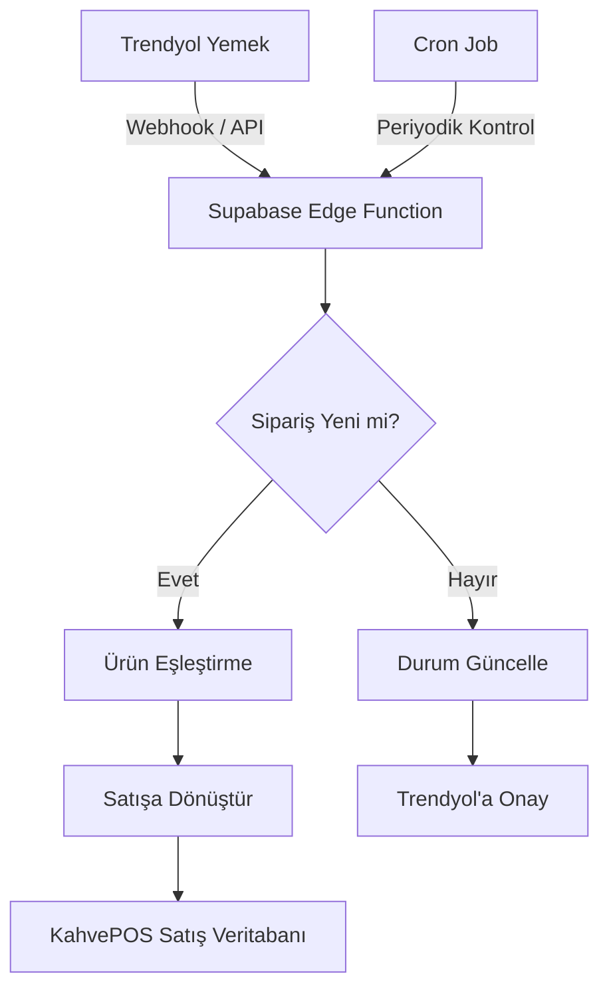

# 🛵 Trendyol Yemek Entegrasyonu - KahvePOS

## 📋 Proje Özeti

Trendyol Yemek'den gelen siparişleri KahvePOS'a otomatik olarak eklemek. Sipariş geldiğinde KahvePOS'da satış olarak görünecek, ürünler otomatik eşleştirilecek.

---

## 🎯 Hedefler

1. Trendyol Yemek API'sinden siparişleri çekmek
2. Gelen siparişleri KahvePOS formatına dönüştürmek
3. Otomatik olarak satış olarak kaydetmek
4. Ürün eşleştirme (Trendyol ürünleri ↔ KahvePOS ürünleri)
5. Sipariş durumu senkronizasyonu

---

## 🏗️ Sistem Mimarisi



### Veri Akışı

```
┌─────────────────┐     Webhook/Cron     ┌──────────────────────┐
│  Trendyol       │ ───────────────────> │  Supabase            │
│  Yemek API      │                     │  Edge Function        │
└─────────────────┘                     │  (trendyol-sync)     │
        ▲                              └──────────────────────┘
        │                                        │
        │  Status Update                         │ HTTP POST
        │                                        ▼
        │                               ┌──────────────────────┐
        │                               │  KahvePOS            │
        │                               │  Sales Table         │
        └───────────────────────────────└──────────────────────┘
```

---

## 📦 Gerekli Bilgiler

### Trendyol Yemek Merchant API

**API Erişimi için:**
1. Trendyol Merchant Paneli → Entegrasyonlar → API Yönetimi
2. `Consumer Key` ve `Consumer Secret` alın
3. `Base URL`: `https://api.trendyol.com/integrationapi`

**Webhook URL:**
- Supabase Edge Function URL'si gerekecek
- Format: `https://<project>.supabase.co/functions/v1/trendyol-webhook`

---

## 🔧 Teknik Detaylar

### 1. Supabase Edge Function

**Dosya:** `supabase/functions/trendyol-sync/index.ts`

```typescript
import 'jsr:@supabase/functions-js/edge-runtime.d.ts'
import { createClient } from 'jsr:@supabase/supabase-js@2'

const corsHeaders = {
  'Access-Control-Allow-Origin': '*',
  'Access-Control-Allow-Headers': 'authorization, x-client-info, apikey, content-type',
}

// Environment variables
const TRENDYOL_CONSUMER_KEY = Deno.env.get('TRENDYOLOL_CONSUMER_KEY')!
const TRENDYOL_SECRET_KEY = Deno.env.get('TRENDYOL_SECRET_KEY')!
const TRENDYOL_SUPPLIER_ID = Deno.env.get('TRENDYOL_SUPPLIER_ID')!

Deno.serve(async (req) => {
  // CORS preflight
  if (req.method === 'OPTIONS') {
    return new Response(null, { headers: corsHeaders })
  }

  try {
    const supabase = createClient(
      Deno.env.get('SUPABASE_URL')!,
      Deno.env.get('SUPABASE_SERVICE_ROLE_KEY')!
    )

    // Webhook'tan gelen sipariş verisi
    const { orderId, status, items, totalAmount } = await req.json()

    // Sipariş durumuna göre işlem
    switch (status) {
      case 'NEW':
        // Yeni sipariş - KahvePOS'a ekle
        await processNewOrder(supabase, orderId, items, totalAmount)
        break
      case 'PREPARING':
        // Hazırlanıyor - Trendyol'a onay ver
        await confirmOrder(orderId)
        break
      case 'READY':
        // Hazır - Bildirim gönder
        await markReady(orderId)
        break
      case 'CANCELLED':
        // İptal - Kaydı güncelle
        await cancelOrder(supabase, orderId)
        break
    }

    return new Response(
      JSON.stringify({ success: true, message: 'Order processed' }),
      { headers: { ...corsHeaders, 'Content-Type': 'application/json' } }
    )
  } catch (error) {
    return new Response(
      JSON.stringify({ success: false, error: error.message }),
      { status: 500, headers: { ...corsHeaders, 'Content-Type': 'application/json' } }
    )
  }
})

async function processNewOrder(supabase: any, orderId: string, items: any[], totalAmount: number) {
  // Ürün eşleştirme
  const processedItems = await matchProducts(supabase, items)
  
  // Satış oluştur
  const sale = {
    id: generateUUID(),
    items: processedItems,
    totalAmount: totalAmount,
    paymentMethod: 'TRENDYOL', // Ödeme Trendyol'dan
    createdBy: 'trendyol',
    createdAt: new Date().toISOString(),
    externalOrderId: orderId, // Trendyol sipariş ID'si
    source: 'trendyol_yemek'
  }

  // Supabase'e kaydet
  await supabase.from('sales').insert(sale)
  
  // Trendyol'a onay gönder
  await confirmOrder(orderId)
}

async function matchProducts(supabase: any, trendyolItems: any[]) {
  const matchedItems = []
  
  for (const item of trendyolItems) {
    // Trendyol SKU'yu KahvePOS ürünüyle eşleştir
    const { data: product } = await supabase
      .from('products')
      .select('*')
      .eq('trendyol_sku', item.sku)
      .single()
    
    if (product) {
      matchedItems.push({
        productId: product.id,
        productName: product.name,
        quantity: item.quantity,
        unitPrice: item.price,
        size: item.size || 'regular'
      })
    } else {
      // Eşleşme bulunamazsa yeni ürün olarak ekle
      matchedItems.push({
        productName: item.name, // Ürün adıyla eşleştir
        quantity: item.quantity,
        unitPrice: item.price
      })
    }
  }
  
  return matchedItems
}

async function confirmOrder(orderId: string) {
  // Trendyol API'ye siparişi onayla
  const response = await fetch(
    `https://api.trendyol.com/integrationapi/orders/${orderId}/status`,
    {
      method: 'POST',
      headers: {
        'Content-Type': 'application/json',
        'Authorization': `Basic ${btoa(TRENDYOL_CONSUMER_KEY + ':' + TRENDYOL_SECRET_KEY)}`
      },
      body: JSON.stringify({ status: 'ACCEPTED' })
    }
  )
  return response.json()
}

function generateUUID() {
  return 'xxxxxxxx-xxxx-4xxx-yxxx-xxxxxxxxxxxx'.replace(/[xy]/g, function(c) {
    const r = Math.random() * 16 | 0
    const v = c === 'x' ? r : (r & 0x3 | 0x8)
    return v.toString(16)
  })
}
```

### 2. Veritabanı Değişiklikleri

**Products tablosuna Trendyol SKU alanı ekle:**

```sql
-- products tablosuna trendyol_sku sütunu ekle
ALTER TABLE products ADD COLUMN IF NOT EXISTS trendyol_sku TEXT;

-- Trendyol siparişlerini takip etmek için tablo
CREATE TABLE trendyol_orders (
  id UUID PRIMARY KEY DEFAULT gen_random_uuid(),
  trendyol_order_id TEXT UNIQUE NOT NULL,
  sale_id UUID REFERENCES sales(id),
  status TEXT DEFAULT 'pending',
  total_amount DECIMAL(10,2),
  customer_name TEXT,
  customer_address TEXT,
  created_at TIMESTAMP WITH TIME ZONE DEFAULT NOW(),
  updated_at TIMESTAMP WITH TIME ZONE DEFAULT NOW()
);

-- Index
CREATE INDEX idx_trendyol_orders_external ON trendyol_orders(trendyol_order_id);
```

### 3. KahvePOS Güncellemeleri

**js/supabase-service.js** - Trendyol siparişlerini listele:

```javascript
async getTrendyolOrders() {
    const { data, error } = await this.supabase
        .from('trendyol_orders')
        .select('*, sales(*)')
        .order('created_at', { ascending: false });
    
    if (error) throw error;
    return data;
}
```

**Ayarlar sayfasına Trendyol entegrasyonu ekle:**

```javascript
// Trendyol ayarları
const TrendyolSettings = {
    apiKey: localStorage.getItem('trendyol_api_key'),
    secretKey: localStorage.getItem('trendyol_secret_key'),
    supplierId: localStorage.getItem('trendyol_supplier_id'),
    enabled: localStorage.getItem('trendyol_enabled') === 'true',
    
    save() {
        localStorage.setItem('trendyol_api_key', this.apiKey);
        localStorage.setItem('trendyol_secret_key', this.secretKey);
        localStorage.setItem('trendyol_supplier_id', this.supplierId);
        localStorage.setItem('trendyol_enabled', this.enabled);
    }
}
```

---

## 🔄 Ürün Eşleştirme Stratejileri

### Yöntem 1: SKU Eşleştirme (Önerilen)
```
Trendyol SKU: "TURK-KAHVE-001"
KahvePOS Ürün SKU: "TURK-KAHVE-001"
```

### Yöntem 2: Ürün Adı Eşleştirme
```
Trendyol: "Türk Kahvesi (Sütlü)"
KahvePOS: "Türk Kahvesi"
```

### Yöntem 3: Manuel Eşleştirme Tablosu
```javascript
const productMapping = {
    'trendyol_product_id_123': 'kahvepos_product_id_456',
    'trendyol_product_id_789': 'kahvepos_product_id_012',
}
```

---

## 📊 Trendyol API Entegrasyon Noktaları

### Ana Endpointler

| Endpoint | Method | Açıklama |
|----------|--------|----------|
| `/orders` | GET | Siparişleri listele |
| `/orders/{orderId}` | GET | Sipariş detayı |
| `/orders/{orderId}/status` | POST | Sipariş durumu güncelle |
| `/products` | GET | Ürünleri listele |
| `/products/{productId}` | GET | Ürün detayı |

### Sipariş Durumları

| Trendyol Durumu | KahvePOS Karşılığı |
|-----------------|-------------------|
| NEW | Yeni sipariş - Otomatik kabul |
| PREPING | Hazırlanıyor |
| READY | Teslime hazır |
| DELIVERED | Teslim edildi |
| CANCELLED | İptal edildi |

---

## 🚀 Kurulum Adımları

### 1. Supabase Edge Function Oluştur

```bash
cd supabase/functions
mkdir -p trendyol-sync
cd trendyol-sync
# index.ts dosyasını oluştur
```

### 2. Environment Variables Ayarla

```bash
supabase secrets set TRENDYOL_CONSUMER_KEY=your_consumer_key
supabase secrets set TRENDYOL_SECRET_KEY=your_secret_key
supabase secrets set TRENDYOL_SUPPLIER_ID=your_supplier_id
```

### 3. Veritabanı Migration

```sql
-- Migration dosyası oluştur: supabase/migrations/014_trendyol_integration.sql
```

### 4. KahvePOS Güncellemeleri

1. Trendyol ayarları UI ekle (Ayarlar sayfası)
2. Trendyol siparişleri listesi görünümü
3. Ürün eşleştirme modalı

### 5. Test

1. Trendyol test modunda sipariş oluştur
2. Webhook'un çalıştığını doğrula
3. KahvePOS'ta siparişin göründüğünü kontrol et

---

## ⚠️ Dikkat Edilecekler

### Güvenlik
- API key'ler Supabase Vault'ta saklanmalı
- Webhook signature doğrulaması yapılmalı
- Rate limiting'e dikkat edilmeli

### Ürün Eşleştirme
- Tüm Trendyol ürünlerinin KahvePOS'ta karşılığı olmayabilir
- Bilinmeyen ürünler için "diğer" kategorisi oluşturulabilir

### Fiyat Farklılıkları
- Trendyol komisyonu düşüldükten sonra fiyat gelir
- Marj hesaplaması buna göre yapılmalı

### İptal Senaryoları
- Trendyol iptal ettiğinde KahvePOS'tan da iptal edilmeli
- Para iadesi Trendyol tarafından yönetilir

---

## 🔗 Faydalı Kaynaklar

- Trendyol Merchant API Dokümantasyonu
- Trendyol Entegrasyon Portalı
- Supabase Edge Functions Dokümantasyonu

---

## ✅ Sonraki Adımlar

1. **Trendyol Merchant API erişimi alın**
   - Partner Panel'den API bilgilerini edinin
   
2. **Supabase Edge Function geliştir**
   - Webhook handler
   - Sipariş işleme mantığı
   - Ürün eşleştirme
   
3. **Veritabanı şemasını güncelle**
   - trendyol_orders tablosu
   - products tablosuna trendyol_sku

4. **KahvePOS UI güncellemeleri**
   - Trendyol ayarları
   - Sipariş listesi görünümü
   - Ürün eşleştirme arayüzü

5. **Test ve doğrulama**
   - Webhook testleri
   - Eşleştirme doğruluğu
   - Hata senaryoları
